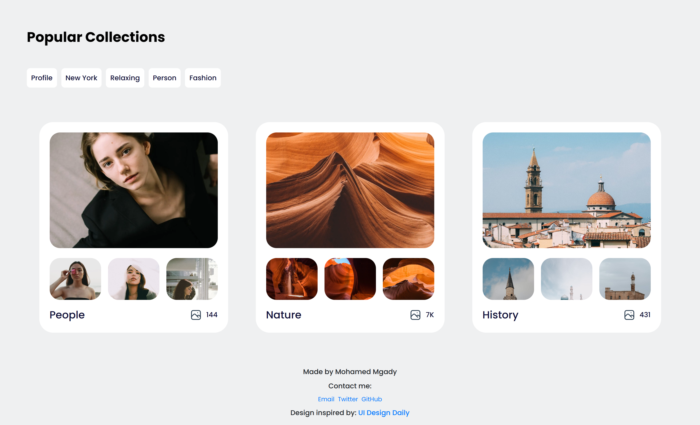

# Collections List Project

This project is a web application that displays a list of collections. It's built with Lit, a simple library for building fast, lightweight web components.

## Features

- Displays a list of collections with details.
- Fully responsive design that looks great on desktop, tablet, and mobile.
- Uses the Poppins font for a modern, clean look.

## Getting Started

### Prerequisites

- Node.js
- npm

### Installation

1. Clone the repo: `https://github.com/M0hamedMagdy/collections-list-litjs`
2. Install NPM packages: `pnpm install`

### Usage

1. Start the development server: `pnpm run dev`
2. Open your browser and visit `http://localhost:5173/`

### Screenshots

## Desktop

## Mobile - Sumsung Galaxy S20 Ultra

.png>)

## Contact

- Mohamed Mgady - mohamedmagdy12@outlook.com
- [Twitter](https://twitter.com/imohameds2)
- [GitHub](https://github.com/M0hamedMagdy/)

## Acknowledgements

- [Design inspired by UI Design Daily](https://www.uidesigndaily.com/posts/figma-collections-list-collection-card-day-1577)
